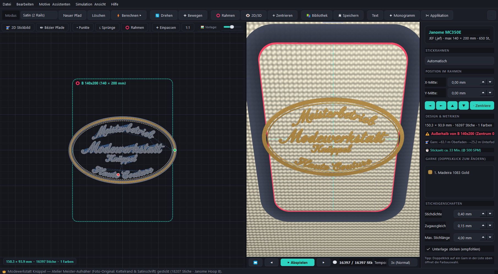
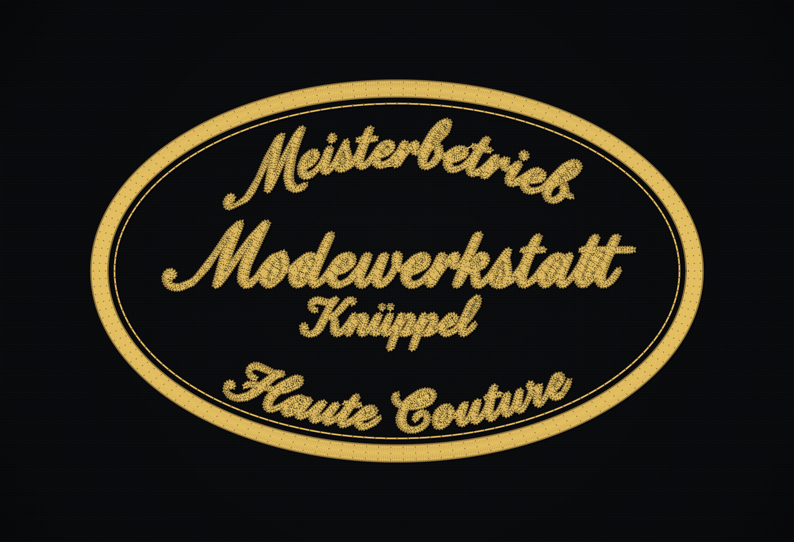
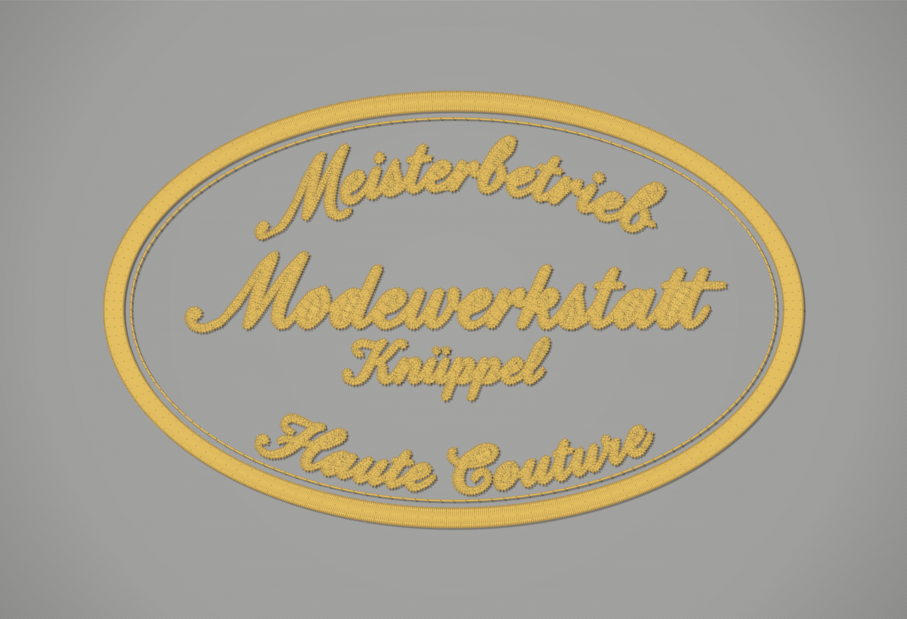

# StickCore Studio 👑 – Professional Embroidery Digitizer & Studio

[](https://isocpp.org/)
[](https://www.qt.io/)
[](https://www.janome.com/)
[](https://www.tajima.com/)
[](LICENSE)

**StickCore Studio** ist eine moderne, hochpräzise Stick- und Digitalisierungssoftware, entwickelt für Modewerkstätten, Ateliers und industrielle Stickmaschinen (insbesondere **Janome MC350E** sowie universelle Tajima DST-Maschinen).



---

## Highlights & Kernfunktionen

### 1. Interaktive 2D Design-Leinwand & 3D OpenGL Faden-Simulation
* **2D Canvas (`Canvas2DWidget`):** Einstichpunkt-Genauigkeit, Fadenläufe, Janome-Rahmenbegrenzungen mit automatischer Überlauf-Erkennung (`#10b981` smaragdgrün / `#f43f5e` rot), 10-mm-Millimetergitter und Vorlagen-Dimmung (0–100 %).
* **3D Echtzeit-Simulation (`StitchGLWidget`):** OpenGL 3.3 Core-Profile mit Blinn-Phong-Schattierung, spekularem Glanz für Madeira-Polyester- und Rayon-Garne, Stofftexturierung und animiertem Nähmaschinen-Playback.

### 2. Janome Digitizer Jr Parität
* **Lettering & Typografie:**
  * Grundlinien: *Gerade*, *Bogen oben (Arc Up)*, *Bogen unten (Arc Down)*, *Kreis (Circle)*
  * Einstellbarer Zeichenabstand (Kerning) und Neigungswinkel (Slant -30° bis +30°)
  * 4 Stickstile: *Erhabener Satin auf Füllung*, *Satin-Kontur*, *Tatami-Webung*, *Steppstich-Lauf*
* **Transformationen:**
  * Horizontal & Vertikal spiegeln (`Ctrl+H` / `Ctrl+V`)
  * 90° Drehen (`Ctrl+R` / `Ctrl+Shift+R`) & freie Gradrotation
  * Automatische Zentrierung im Stickrahmen (`Ctrl+0`)
* **Rahmenbibliothek:**
  * Hoop A (126 × 110 mm), Hoop B (140 × 200 mm), Hoop C (50 × 50 mm Freiarm), Hoop SQ14 (140 × 140 mm), Hoop D (230 × 200 mm GigaHoop)

### 3. Foto-Originalgetreue Vektor-Digitalisierung (`AuthenticPatchSatin`)
Speziell für das Atelier-Wappen der **Modewerkstatt Knüppel** entwickelt:
* **3,8 mm radialer Satin-Kettelrand (Merrow-Satinkante):** Massiver, dichter Kettelrand mit Center-Track- und Edge-Walk-Unterlegern sowie Zugausgleich.
* **Innerer Akzentring:** Exakt 1,8 mm nach innen versetzter doppelter Laufstichring.
* **Erhabene Satinschrift:** 4 Zeilen (*Meisterbetrieb*, *Modewerkstatt*, *Knüppel*, *Haute Couture*) mit 45°-Stabilisierungsunterleger, dichter 15°-Satinfüllung und 0,60 mm Kontur-Kantenverriegelung (18.207 Stiche in Madeira Gold).

| Reales Foto des Aufnähers | Authentische StickCore-Simulation |
|:---:|:---:|
|  |  |

### 4. Smartphone QR-Code Foto-Upload
* Integrierter lokaler HTTP-Server (`net/QrUploadServer`) mit dynamischer QR-Code-Generierung (`net/QrCode`).
* Ermöglicht das Hochladen von Vorlagen direkt aus der Smartphone-Mediathek, Dateimanager oder per Sofortaufnahme – ohne Cloud, vollkommen offline im lokalen WLAN.

### 5. Multi-Format Export
* **Janome JEF:** Exakte binäre Header (Version 0x14), Maschinengrenzen, Janome-Farbtabellen und Endemarker (`0x80 0x10`). Direkt kompatibel mit USB-Stick für Janome MC350E (`\EMBF\`).
* **Tajima DST:** Industriestandard mit 3-Byte-Differenzkodierung für Brother, Bernina, Ricoma, Melco und Barudan.
* **HTML-Produktionsblatt:** Mit Garnverbrauch (Ober- und Unterfaden) und Zeitkalkulation.

---

## Projektstruktur

```
src/
├── codec/           # JEF- und DST-Parser und Exporter
├── core/            # Stichdaten-Typen, Farbpaletten & Geometrie-Operatoren
├── editor/          # 2D Canvas & Bézier-Pfad-Editor
├── generators/      # Stick-Generatoren (Satin, Tatami, Applikation, Monogramm, Vektor-SVG)
├── gl/              # OpenGL 3.3 3D-Fadensimulation & Stoff-Shader
├── library/         # Motiv-Bibliothek mit Sofortvorlagen
├── net/             # Lokaler QR-Upload HTTP-Server & QR-Encoder
├── ui/              # Dialoge (Lettering, Farben, Einrichtungsassistent)
├── MainWindow.*     # Hauptanwendungsfenster & Menüsteuerung
└── main.cpp         # Einstiegspunkt & CLI-Screenshot-Schnittstelle
```

---

## Kompilierung & Ausführung

### Voraussetzungen
* **C++20-fähiger Compiler** (GCC 13+ / MinGW64 oder MSVC 2022)
* **CMake 3.20+**
* **Qt 6.4+** (`Core`, `Gui`, `Widgets`, `OpenGL`, `OpenGLWidgets`, `Svg`, `Network`)

### Build-Befehle
```bash
# Repository klonen
git clone https://github.com/MicBur/StickCore.git
cd StickCore

# CMake konfigurieren & bauen
cmake -B build -S . -DCMAKE_BUILD_TYPE=Release
cmake --build build -j8

# Anwendung starten
./build/StickCore
```

### Tests ausführen
```bash
./build/StickCoreTests
```
Alle Unit-Tests (Satin-Splits, Tatami-Phasenversatz, JEF-Roundtrip, DST-Codec, Bogenlettering, Rahmentransformationen) laufen automatisiert durch.

---

## Dokumentation & Handbuch

Das vollständige, bebilderte Benutzerhandbuch steht im Projektverzeichnis und als druckfertiges PDF bereit:
* [`docs/StickCore_Benutzerhandbuch.pdf`](docs/StickCore_Benutzerhandbuch.pdf)
* [`docs/StickCore_Benutzerhandbuch.html`](docs/StickCore_Benutzerhandbuch.html)

---

## Lizenz

Dieses Projekt ist unter der **MIT-Lizenz** lizenziert.
Entwickelt mit Leidenschaft für Präzision und textile Kunstfertigkeit.
